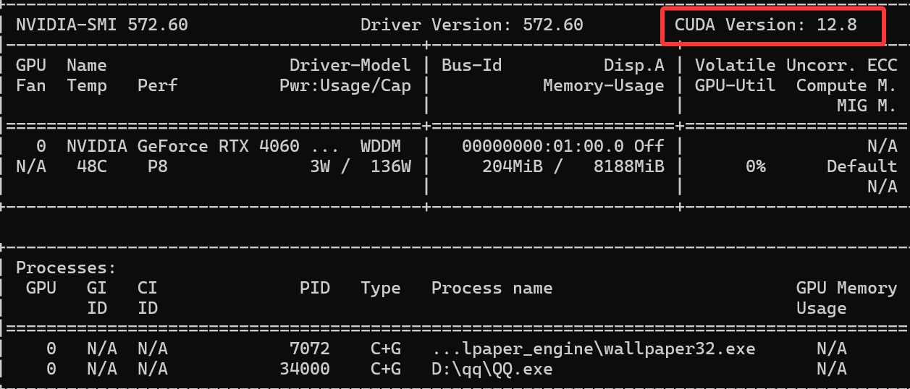

# 依赖包体 (Python环境需要3.8以下)

```
pip install ultralytics
pip install onnx
pip install onnxslim onnxruntime
```

pytz, py-cpuinfo, mpmath, zipp, urllib3, tzdata, typing-extensions, sympy, six, pyyaml, pyparsing, psutil, pillow, packaging, numpy, networkx, MarkupSafe, kiwisolver, idna, fsspec, fonttools, filelock, cycler, colorama, charset-normalizer, certifi, tqdm, scipy, requests, python-dateutil, opencv-python, jinja2, importlib-resources, contourpy, torch, pandas, matplotlib, ultralytics-thop, torchvision, ultralytics

# 使用GPU

```
https://developer.nvidia.com/cuda-toolkit-archive
```

在这个网站上找自己的NVIDIA版本

```
nvidia-smi
```

这个在cmd下可以查看自己的cuda版本



一定要注意自己用的python版本和torch版本还有torchvision版本要对得上，并且是可以使用GPU的版本

## 网页：快速入门

```
https://docs.ultralytics.com/zh/quickstart/#use-ultralytics-with-python
```

```
from ultralytics import YOLO
# 加载预训练的 YOLOv11n 模型
model = YOLO('yolo11n.pt')
# 定义图像文件的路径
source = r'C:\Users\柳院梅厅\Desktop\v2-93aba9c44bf90fbae5d983b9528b5f93_r.jpg'  #更改为自己的图片路径
# 运行推理，并附加参数
model.predict(source, save=True)
```

这里测试了两个图片，一个火焰一个猫，火焰识别成了花瓶 (vase)，猫识别成功 (cat)。说明我们要自定义训练集来训练模型。

# 训练模型

## 网页：训练

```
https://docs.ultralytics.com/zh/modes/train/
```

### labelimg划分自定义训练


具体内容可看这篇博客

```
https://blog.csdn.net/qq_67105081/article/details/137545156
```

## 网络数据集

```
https://universe.roboflow.com/
```

这个网站上可以下载对应划分好的数据集

## 训练语句

```
from ultralytics import YOLO

def main():
   # Load a model
   model = YOLO("yolo11n.yaml")  # build a new model from YAML
   model = YOLO("yolo11n.pt")  # load a pretrained model (recommended for training)
   model = YOLO("yolo11n.yaml").load("yolo11n.pt")  # build from YAML and transfer weights

   # Train the model
   results = model.train(data=r'C:\Users\柳院梅厅\Desktop\实验室\人工智能部\识别\训练集\fire.v2i.yolov11\data.yaml', epochs=200, batch=16,imgsz=640,device=0)#数据集配置文件的路径
      #epochs  训练轮次总数
      #batch 批量大小，即单次输入多少图片训练
      #imgsz 训练图像尺寸
      #workers  加载数据的工作线程数
      #device 指定训练的计算设备，无nvidia显卡则改为 'cpu'
      #optimizer='SGD',  训练使用优化器，可选 auto,SGD,Adam,AdamW 等
      #amp= True,  True 或者 False, 解释为：自动混合精度(AMP) 训练
      #cache=False   True 在内存中缓存数据集图像，服务器推荐开启
if __name__ == '__main__':
    main()  # 通过主函数调用训练逻辑
```


# 安装依赖

```
# 创建新的虚拟环境
python -m venv .venv
source .venv/bin/activate  # Linux/macOS
.\.venv\Scripts\activate   # Windows

# 安装依赖
pip install -r requirements.txt
```

